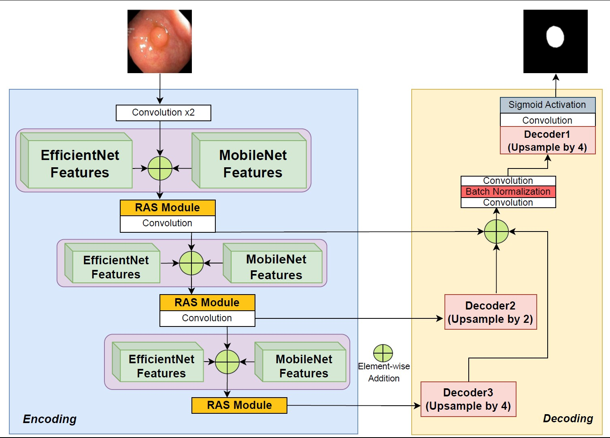
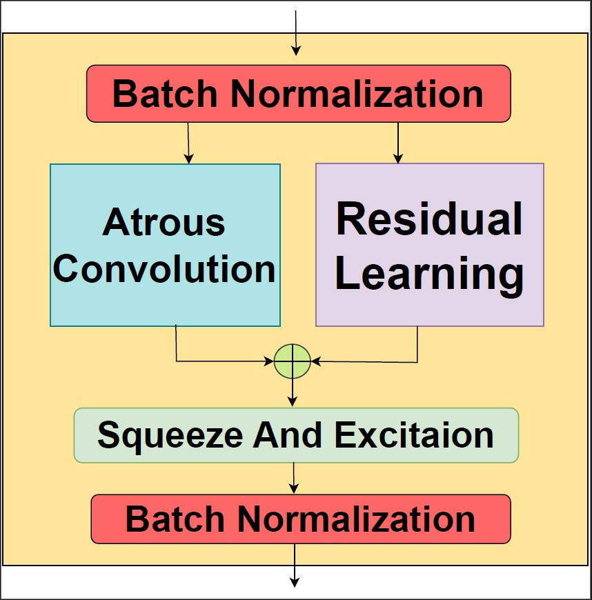
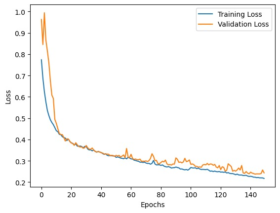
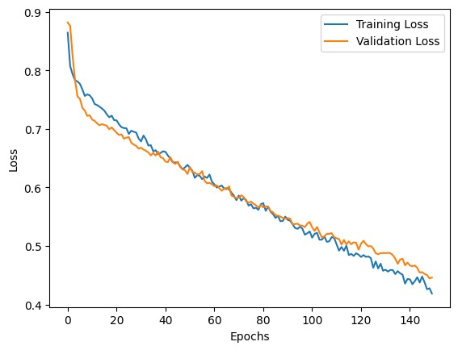
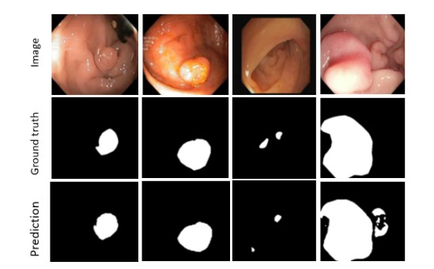

# DRASU-Net: Dual-backbone and Residual Atrous Squeeze module-aided U-Net Model for Polyp Segmentation - Accepted at [MIUA25](https://conferences.leeds.ac.uk/miua/)

Authors : [Utathya Aich](https://www.linkedin.com/in/utathyaaich/)\*, [Ritabrata Roy](https://www.linkedin.com/in/ritabrata-roy-72b504243/)\*, Dmitrii Kaplun, and [Ram Sarkar](https://scholar.google.co.in/citations?user=bDj0BUEAAAAJ&hl=en)

\* Equally contributing first authors

This is the official implementation of "DRASU-Net: Dual-backbone and Residual Atrous Squeeze module-aided U-Net Model for Polyp Segmentation".

### Proposed workflow:



<table>
  <tr>
    <th>RAS Module</th>
  </tr>
  <tr>
    <td></td>
  </tr>
</table>


## Abstract
Polyp segmentation in colonoscopy images is essential for the early detection and treatment of colorectal cancer. Accurate segmentation aids in diagnosis and reduces risks of malignancy. Existing deep learning models often struggle with the trade-off between semantic understanding and spatial precision, requiring extensive computational resources that limit their deployment in real-world, resource-constrained clinical settings. The need for an optimized yet high-performing segmentation model remains an open challenge. To bridge this gap, we propose Dual-backbone and Residual Atrous Squeeze module-aided U-Net (DRASU-Net), optimized for low-resource environments. Our model features a dual-backbone and multi-scale feature learning approach, integrating EfficientNetB4 and MobileNetV2 to balance feature richness and spatial details. We introduce the RAS module, which leverages Atrous Convolutions, Residual Connections, and Squeeze-and-Excite (SE) blocks to enhance feature recalibration and improve segmentation accuracy. Experiments on the CVC-ClinicDB and Kvasir-SEG datasets demonstrate that DRASU-Net outperforms other methods, with a dice score of 0.9540 on CVC-ClinicDB and 0.9525 on Kvasir-SEG, while maintaining only 10.72 million parameters. DRASU-Net exhibits strong generalization when evaluated across multiple polyp segmentation datasets.


<table>
  <tr>
    <th>CVC- ClinicDB Loss Curve</th>
    <th>Kvasir-Seg  Loss Curve</th>
  </tr>
  <tr>
    <td></td>
    <td></td>
  </tr>
</table>


### Sample DRASU-Net Predictions

<p>
  
</p>


## Citation: 
Please do cite our paper in case you find it useful for your research.<br/>
If you're using this article or code in your research or applications, please consider citing using this BibTeX:<br/>
```
@inproceedings{aich2025drasunet,
  title={DRASU-Net: Dual-backbone and Residual Atrous Squeeze module-aided U-Net Model for Polyp Segmentation},
  author={Aich, Utathya and Roy, Ritabrata and Kaplun, Dmitrii and Sarkar, Ram},
  booktitle={Proceedings of the Medical Image Understanding and Analysis (MIUA) Conference},
  year={2025},
  note={Accepted for publication}
}
```
<br/>
